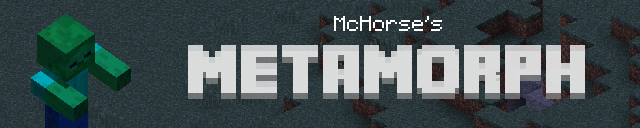

[Download](https://github.com/mchorse/metamorph/releases/) – [PMC post](http://planetminecraft.com/mod/metamorph/) – [Minecraft Forum post](http://www.minecraftforum.net/forums/mapping-and-modding/minecraft-mods/2753214-metamorph-morph-into-vanilla-mobs) – [AdFly support link](http://adf.ly/15268913/metamorph-101)

**Metamorph** (from *[Metamorphosis](https://en.wikipedia.org/wiki/Metamorphosis)*) – a Minecraft mod for 1.10.2 (there is also build for 1.9.4), which allow players to morph into different vanilla mobs. Heavily inspired by iChun's Morph mod and zacuke's Shape Shifter Z mod. 

## Videos

Mod review made by **McHorse** (me):

Mod showcase by **xJSQ**:

## Installation 

Install [Minecraft Forge](http://files.minecraftforge.net/), then go to [releases](https://github.com/mchorse/metamorph/releases) and download the latest stable version (not a pre-release) of jar file. Put it in minecraft's `mods` folder, and launch the game. 

After that, Metamorph mod should be installed and will appear in Minecraft's mods menu. If Metamorph didn't appear in the mods menu, then something went wrong.

## How to play

To morph into other creatures, you must to acquire a *morph* first. To acquire a *morph*, you have to kill a mob, then a ghost of a mob will appear (that's a *morph*), and when you'll pick it up, you'll acquire a *morph*. Only vanilla\* mobs have their own *morphs*.

Once you have at least one *morph*, you're able to transform into that *morph*. Use `[` and `]` keys for advancing through the list of *morphs*. Use `enter` key for transforming into selected *morph*. To demorph, you scroll left until you select your character, and then press `enter` to demorph. Or you can press demorph key (which is `.` by default).

You retain your *morphs* even after death (although . In creative, you can select any available *morph* via "Creative Morph Menu" which can be opened by pressing `B` key in the game.

The outer look of *morphs* are quite limited, so you cannot kill a child pink sheep and turn into a child pink sheep. Instead, you'll turn into a white adult sheep.

\* – vanilla mobs that are listed below.

## About morphs

Every *morph* you equip or apply grant you different look, size, and health capacity. Except those properties, every *morph* also has special *abilities*, *attack* and *action*. 

*Abilities* give special properties to *morphs*. **Chicken** *morph* will slowly fall and get no fall damage. **Spider** and **CaveSpider** *morphs* will be able to climb on the wall. **Bat** *morph* will be able to fly and has a night vision.

*Attack* is an effect which is applied onto attacked entity. For example, if you hit some entity while being in **CaveSpider** *morph*, your target will gain **poison** potion effect. If you'll hit an entity while being in **VillagerGolem** *morph*, you'll throw your target high in the air.

*Action* is a special ability that is triggered by "action key" (which is `V` by default). Examples: in **Rabbit** *morph*, you'll jump high; in **Creeper** *morph*, you'll explode like a creeper, and so on.

## Available morphs

A full list of which vanilla morphs are available in the mod (as of 1.0), you can find [here](https://github.com/mchorse/metamorph/issues/1).

If you wonder about the future of this project, and what new updates might bring in, then make sure to checkout [issues page on GitHub](https://github.com/mchorse/metamorph/issues).

If you found a bug, or this mod crashed you game. I'll appreciate if you could report the bug or crash to me either in issues or on [Twitter](https://twitter.com). Please, make sure to attach a crash log ([pastebin](http://pastebin.com) please) and description of a bug or crash and the way to reproduce it. Thanks!

## License

This project is licensed under MIT. See `LICENSE.md` file.

## For reposters

When reposting my mod on your own website, please do following (if you want to support me and this mod):

* Don't distort the mod name, it's not *MetaMorph* or *METAMORPH*. It's *Metamorph*.
* Make sure that information and description of my mod is legit. Misleading information, like Minecraft version support, is your responsibility.
* By uploading a custom build of this mod, the build becomes your responsibility.
* Provide the source link, please. Either it's GitHub page, Planet Minecraft or Minecraft Forum post.
* You can use Metamorph [banner](http://i.imgur.com/gbHB5iQ.png) or [cover](http://i.imgur.com/BkmzcAF.png) for your repost page. Don't apply the watermark, though, that's just rude.

## For YT reviewers

When reviewing my mod on your YT channel, please do following (if you want to support me and this mod):

* Don't distort the mod name, it's not *MetaMorph* or *METAMORPH*. It's *Metamorph*.
* Provide a link to my [YouTube channel](https://www.youtube.com/channel/UCWVDjAcecHHa8UrEWMRGI8w), please. This will be really appreciated! 
* Provide the source link instead of reposter's page, please. Either it's GitHub page, Planet Minecraft or Minecraft forum post. However, if you have a website where you post some notes or instructions along with link to source link, it's also fine. AdFly link will be really appreciated!§